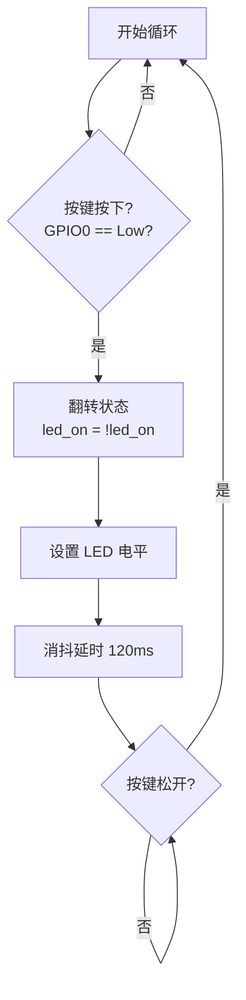

# 🦀 Rust + ESP32-S3 入门实战：按键控制 LED

> **作者**：CXi
> **硬件**：ESP32-S3R8N8 嘉立创开发板
> **语言**：Rust（esp-hal 硬件抽象层）
> **难度**：⭐ 入门级
> **适合人群**：有 Rust 基础，想入门嵌入式开发的同学

---

## 📖 目录

1. [项目简介](#1-项目简介)
2. [硬件介绍](#2-硬件介绍)
3. [电路原理](#3-电路原理)
4. [开发环境搭建](#4-开发环境搭建)
5. [项目结构](#5-项目结构)
6. [代码逐行详解](#6-代码逐行详解)
7. [编译与烧录](#7-编译与烧录)
8. [运行效果](#8-运行效果)
9. [常见问题](#9-常见问题)
10. [扩展练习](#10-扩展练习)

---

## 1. 项目简介

本教程将带你用 **Rust** 语言在 **ESP32-S3** 开发板上实现一个经典入门项目：

> **每按一次按键，LED 状态翻转一次**

```
LED 关 ──按一下──→ LED 开 ──按一下──→ LED 关 ──→ ...
```

这个项目虽然只有 **39 行代码**，但涵盖了嵌入式开发的核心知识点：

| 知识点 | 你在代码中会看到 |
|--------|----------------|
| GPIO 输出 | `Output::new()` — 控制 LED 亮灭 |
| GPIO 输入 | `Input::new()` — 读取按键状态 |
| 上拉电阻 | `Pull::Up` — 让引脚默认保持高电平 |
| 按键消抖 | `delay.delay_millis(120)` — 避免机械抖动 |
| 主循环 | `loop {}` — 嵌入式程序的运行模式 |

---

## 2. 硬件介绍

### 2.1 ESP32-S3R8N8 嘉立创开发板


**芯片参数：**

| 参数 | 值 |
|------|-----|
| 芯片 | ESP32-S3 |
| CPU | Xtensa LX7 双核，240MHz |
| Flash | 8MB（N8） |
| PSRAM | 8MB（R8） |
| WiFi | 802.11 b/g/n |
| 蓝牙 | BLE 5.0 |

### 2.2 引脚图


本教程用到的两个关键引脚：

| 引脚 | 用途 | 说明 |
|------|------|------|
| **GPIO0** | 按键输入 | 板载 BOOT 按键，默认高电平，按下变低电平 |
| **GPIO48** | LED 输出 | 板载 RGB LED 数据引脚（低电平点亮） |

### 2.3 你需要准备什么

- ✅ ESP32-S3R8N8 嘉立创开发板 × 1
- ✅ Type-C USB 数据线 × 1
- ✅ 电脑（Windows / macOS / Linux）

> 💡 **好消息**：嘉立创开发板自带 BOOT 按键和板载 LED，不需要额外接线！一根 USB 线就够了。

---

## 3. 电路原理

### 3.1 按键电路（GPIO0 输入）

```
     VCC (3.3V)
        │
        ▼
    ┌───────┐
    │ 10kΩ  │  上拉电阻（ESP32 内部也有 ~45kΩ）
    │ 上拉   │
    └───┬───┘
        │
        ├──────── GPIO0 ──→ ESP32-S3 芯片
        │
        ▼
    ┌───────┐
    │ BOOT  │  按键开关
    │ 按键   │
    └───┬───┘
        │
        ▼
       GND
```

**工作原理：**

| 按键状态 | GPIO0 电平 | Rust 读取 |
|----------|-----------|-----------|
| 未按下 | 高电平 3.3V | `key.is_high()` = true |
| **按下** | **低电平 0V** | **`key.is_low()` = true** |

> 按键按下 → GPIO0 直连 GND → 电平被"拉低" → 程序检测到 `is_low()`

### 3.2 LED 电路（GPIO48 输出）

```
    GPIO48 ──→ ESP32-S3 芯片
        │
        ▼
    ┌───────┐
    │ 330Ω  │  限流电阻（保护 LED）
    │ 限流   │
    └───┬───┘
        │
        ▼
    ┌───────┐
    │  LED  │  发光二极管
    └───┬───┘
        │
        ▼
       GND
```

**⚠️ 重要：嘉立创开发板的 LED 是低电平点亮（Active Low）**

| GPIO48 输出 | LED 状态 | Rust 代码 |
|-------------|----------|-----------|
| **低电平** | **✅ 亮** | `Level::Low` |
| 高电平 | ❌ 灭 | `Level::High` |

> LED 阳极接 VCC、阴极经电阻接 GPIO → GPIO 输出低电平时形成通路 → LED 亮

### 3.3 整体电路框图

```
    ┌──────────────────────────────────────────────┐
    │              ESP32-S3 芯片                     │
    │                                               │
    │  GPIO0 (输入)              GPIO48 (输出)       │
    │     ↑                         │               │
    │     │                         ▼               │
    │  ┌──┴──┐                  ┌──┴──┐            │
    │  │读取  │                  │控制  │            │
    │  │按键  │                  │LED  │            │
    │  └──┬──┘                  └──┬──┘            │
    └─────┼────────────────────────┼───────────────┘
          │                        │
          ▼                        ▼
     ┌────────┐              ┌──────────┐
     │BOOT按键│              │ 330Ω电阻  │
     └───┬────┘              └────┬─────┘
         │                        │
        GND                       ▼
                            ┌──────────┐
                            │   LED    │
                            └────┬─────┘
                                 │
                                GND
```

---

## 4. 开发环境搭建

### 4.1 安装 Rust

```bash
curl --proto '=https' --tlsv1.2 -sSf https://sh.rustup.rs | sh
```

### 4.2 安装 ESP32 工具链

```bash
# 安装 espup（ESP32 Rust 工具链管理器）
cargo install espup

# 安装 ESP32 Xtensa 工具链
espup install

# 安装烧录工具
cargo install espflash --locked
cargo install probe-rs-tools --locked
```

### 4.3 配置环境变量

```bash
# Linux / macOS
source $HOME/export-esp.sh

# Windows（PowerShell）
# 运行 espup install 后会提示环境变量路径
```

### 4.4 克隆项目

```bash
git clone https://github.com/cx693/Rust_ESP32_Dome.git
cd Rust_ESP32_Dome/examples/按键LED
```

---

## 5. 项目结构

```
Rust_ESP32_Dome/
├── README.md                  ← 项目说明
├── examples/
│   ├── hello/                 ← Hello World 入门
│   ├── LED/                   ← LED 闪烁
│   ├── 按键LED/               ← ⭐ 本教程项目
│   │   ├── .cargo/
│   │   │   └── config.toml    ← Cargo 构建配置
│   │   ├── src/
│   │   │   └── bin/
│   │   │       └── main.rs    ← ⭐ 主程序代码
│   │   └── Cargo.toml         ← 依赖声明
│   ├── PWM/                   ← PWM 控制
│   ├── ADC/                   ← 模数转换
│   └── ...                    ← 更多示例
└── dome/                      ← 进阶项目（SPI 显示屏等）
```

**Cargo.toml 依赖：**

```toml
[dependencies]
esp-hal = "0.23"                   # ESP32 硬件抽象层
esp-bootloader-esp-idf = "0.10"    # ESP-IDF 引导加载程序
panic-rtt-target = "0.2"           # panic 时通过 RTT 输出错误
rtt-target = "0.6"                 # RTT 日志输出
```

---

## 6. 代码逐行详解

### 6.1 嵌入式必需声明

```rust
#![no_main]
#![no_std]
```

| 声明 | 作用 | 为什么需要 |
|------|------|-----------|
| `#![no_main]` | 禁用标准 `main` 入口 | 嵌入式没有操作系统，用 `#[main]` 宏替代 |
| `#![no_std]` | 禁用标准库 `std` | `std` 依赖 OS 功能（文件/网络/线程），嵌入式只能用 `core` |

### 6.2 导入依赖

```rust
use esp_bootloader_esp_idf;            // ESP-IDF 引导加载程序

use esp_hal::{
    delay::Delay,                       // 软件延时器
    gpio::{                             // GPIO 相关类型
        Input,          // 输入模式（读取按键）
        InputConfig,    // 输入配置
        Level,          // 电平枚举（High / Low）
        Output,         // 输出模式（控制 LED）
        OutputConfig,   // 输出配置
        Pull,           // 上拉/下拉电阻
    },
    main,                               // 程序入口宏
};

use panic_rtt_target as _;              // panic 时通过 RTT 输出错误信息
use rtt_target::{rprintln, rtt_init_print};  // RTT 日志宏
```

**模块关系图：**

```
esp-hal（硬件抽象层）
│
├── gpio
│   ├── Output    → 控制引脚输出高低电平 → 驱动 LED
│   ├── Input     → 读取引脚高低电平    → 检测按键
│   ├── Pull      → 配置上拉/下拉电阻   → 让引脚有默认电平
│   └── Level     → High / Low 枚举    → 表示电平状态
│
├── delay
│   └── Delay     → 软件延时           → 按键消抖
│
└── main          → #[main] 宏         → 替代标准 main
```

### 6.3 应用描述符

```rust
esp_bootloader_esp_idf::esp_app_desc!();
```

生成 ESP-IDF 引导加载程序需要的元数据（版本、大小等）。烧录时引导加载程序会读取它来验证固件合法性。

### 6.4 程序入口

```rust
#[main]
fn main() -> ! {
    rtt_init_print!();
    rprintln!("=== 按键控制 LED 启动 ===");
```

| 语法 | 含义 |
|------|------|
| `#[main]` | esp-hal 的入口宏，替代标准 `fn main()` |
| `-> !` | "永不返回"类型 — 嵌入式程序永远运行，不会退出 |
| `rtt_init_print!()` | 初始化 RTT 日志通道 |
| `rprintln!()` | 类似 `println!`，通过 RTT 输出到调试器 |

> 💡 **RTT（Real-Time Transfer）** 是 SEGGER 的调试协议，可在不占用串口的情况下实时输出日志。需要 J-Link 或支持 RTT 的调试器查看。

### 6.5 初始化外设

```rust
    let peripherals = esp_hal::init(esp_hal::Config::default());
```

```
芯片上电
   │
   ▼
esp_hal::init()
   │
   ├── 配置时钟系统
   ├── 配置电源管理
   ├── 初始化 GPIO 控制器
   └── 返回 peripherals 对象
   │
   ▼
peripherals.GPIO0, peripherals.GPIO48, ...
```

`peripherals` 对象包含芯片所有外设的句柄，通过 `peripherals.GPIOxx` 访问具体引脚。

### 6.6 配置 LED 引脚（输出）

```rust
    let mut led = Output::new(
        peripherals.GPIO48,     // 引脚：GPIO48（板载 LED）
        Level::Low,             // 初始电平：低（LED 亮）
        OutputConfig::default() // 默认推挽输出
    );
```

| 参数 | 值 | 含义 |
|------|-----|------|
| 引脚 | `GPIO48` | 嘉立创开发板板载 LED 引脚 |
| 初始电平 | `Level::Low` | 低电平 = LED 亮（Active Low） |
| 配置 | `OutputConfig::default()` | 推挽输出，可输出高/低电平 |

### 6.7 配置按键引脚（输入）

```rust
    let key = Input::new(
        peripherals.GPIO0,                          // 引脚：GPIO0（BOOT 按键）
        InputConfig::default().with_pull(Pull::Up)  // 启用内部上拉电阻
    );
```

**`Pull::Up` 的作用：**

```
不启用上拉：                启用上拉 Pull::Up：
GPIO 引脚悬空               GPIO 被内部电阻拉到 VCC
电平不确定 ⚠️               电平稳定为高电平 ✅
```

> ESP32-S3 内部有约 45kΩ 可编程上拉电阻，`Pull::Up` 启用后，按键未按下时引脚自动保持高电平。

### 6.8 定义状态和延时器

```rust
    let mut led_on: bool = false;  // LED 状态：false=关，true=开
    let delay = Delay::new();       // 软件延时器
```

### 6.9 主循环（核心逻辑）

```rust
    loop {
        // ① 检测按键是否按下
        if key.is_low() {

            // ② 翻转 LED 状态
            led_on = !led_on;
            rprintln!("按键按下 → LED {}", if led_on { "开" } else { "关" });

            // ③ 设置 LED 电平
            led.set_level(if led_on { Level::Low } else { Level::High });

            // ④ 消抖延时 120ms
            delay.delay_millis(120);

            // ⑤ 等待按键松开
            while key.is_low() {}
        }
    }
```

**5 步详解：**

| 步骤 | 代码 | 作用 |
|------|------|------|
| ① | `if key.is_low()` | 检测 GPIO0 是否为低电平（按键按下） |
| ② | `led_on = !led_on` | 翻转状态：true→false 或 false→true |
| ③ | `led.set_level(...)` | 根据状态设置 GPIO48 输出低/高电平 |
| ④ | `delay.delay_millis(120)` | 等待 120ms，跳过机械抖动 |
| ⑤ | `while key.is_low() {}` | 死等按键松开，防止按住连续触发 |

**按键消抖原理：**

```
按键按下时的真实电平波形：

  高 ───┐    ┌─┐ ┌─┐ ┌───
        │    │ │ │ │ │
  低 ───┴────┘ └─┘ └─┘ └───── 稳定低电平
        │←─抖动→│
        │← 120ms →│
              ↑
        延时跳过这段抖动期
```

> 机械按键的金属触片在接触瞬间会弹跳多次，产生几毫秒的电平抖动。延时 120ms 等电平稳定后再继续操作，避免误判。

**主循环流程图：**



---

## 7. 编译与烧录

### 7.1 编译

```bash
cd Rust_ESP32_Dome/examples/按键LED
cargo build --release
```

> ⚠️ 嵌入式项目一定要用 `--release`，debug 模式的二进制文件可能太大无法烧录。

### 7.2 烧录

```bash
cargo run --release
```

输出示例：

```
   Compiling 按键LED v0.1.0
    Finished `release` profile [optimized] target(s) in 5.23s
     Running `espflash flash --monitor`
Serial port: /dev/ttyUSB0
Connecting...
Flashing...
Done!
```

### 7.3 进入下载模式（如果烧录失败）

1. **按住 BOOT 按键不放**
2. **按一下 RST 按键**
3. **松开 BOOT 按键**
4. 重新执行 `cargo run --release`

---

## 8. 运行效果

### 串口日志输出

```
=== 按键控制 LED 启动 ===
按键按下 → LED 开
按键按下 → LED 关
按键按下 → LED 开
按键按下 → LED 关
```

### 实际效果

```
  ┌─────────────────────────────────────┐
  │       ESP32-S3 嘉立创开发板          │
  │                                     │
  │   [BOOT] 按键          [LED] 灯     │
  │    GPIO0               GPIO48       │
  │                                     │
  │   按一下 ───→  LED 亮  💡           │
  │   按一下 ───→  LED 灭  🌑           │
  │   按一下 ───→  LED 亮  💡           │
  │   ...无限循环...                    │
  └─────────────────────────────────────┘
```

> 📸 **建议**：拍摄 LED 亮/灭的对比照片，或录一段 GIF 演示按键效果，插入到此处。

---

## 9. 常见问题

### Q1：编译报错 `can't find crate for core`

**原因**：没装 ESP32 工具链

```bash
espup install
source $HOME/export-esp.sh
```

### Q2：烧录失败 `Failed to connect`

**原因**：开发板没进入下载模式

**解决**：按住 BOOT → 按一下 RST → 松开 BOOT → 重新烧录

### Q3：LED 不亮 / 逻辑反了

**原因**：不同开发板 LED 接法不同

**解决**：交换 `Level::Low` 和 `Level::High`：

```rust
// 原代码（低电平点亮）
led.set_level(if led_on { Level::Low } else { Level::High });

// 改为（高电平点亮）
led.set_level(if led_on { Level::High } else { Level::Low });
```

### Q4：按键按一次触发多次

**原因**：消抖时间不够

```rust
delay.delay_millis(200);  // 从 120ms 增大到 200ms
```

### Q5：看不到 RTT 日志

**原因**：RTT 需要 J-Link 等调试器

**解决**：改用串口输出，添加 `esp-println` 依赖：

```toml
[dependencies]
esp-println = { version = "0.13", features = ["esp32s3"] }
```

```rust
// 替换 rprintln
esp_println::println!("按键按下 → LED {}", if led_on { "开" } else { "关" });
```

---

## 10. 扩展练习

| 练习 | 说明 | 难度 |
|------|------|------|
| LED 闪烁 | 不用按键，LED 自动每 500ms 翻转 | ⭐ |
| 多 LED 模式 | 3 个 LED，按键循环切换闪烁模式 | ⭐⭐ |
| 长按/短按 | 短按切换，长按 1s 全部关闭 | ⭐⭐ |
| 外部中断 | GPIO 中断替代轮询，降低 CPU 占用 | ⭐⭐⭐ |
| PWM 呼吸灯 | 按键切换 LED 亮度等级 | ⭐⭐⭐ |

---

## 📝 完整源码

```rust
//! ============================================================
//! 按键控制 LED 示例
//! 功能：每按一次按键，LED 翻转一次（亮 → 灭 → 亮 → ...）
//! 硬件：ESP32-S3，GPIO0 接按键，GPIO48 接 LED
//! ============================================================

#![no_main]
#![no_std]

use esp_bootloader_esp_idf;
use esp_hal::{
    delay::Delay,
    gpio::{Input, InputConfig, Level, Output, OutputConfig, Pull},
    main,
};
use panic_rtt_target as _;
use rtt_target::{rprintln, rtt_init_print};

esp_bootloader_esp_idf::esp_app_desc!();

#[main]
fn main() -> ! {
    rtt_init_print!();
    rprintln!("=== 按键控制 LED 启动 ===");

    // 初始化芯片外设
    let peripherals = esp_hal::init(esp_hal::Config::default());

    // 配置 LED（GPIO48 输出，低电平点亮）
    let mut led = Output::new(peripherals.GPIO48, Level::Low, OutputConfig::default());

    // 配置按键（GPIO0 输入，内部上拉）
    let key = Input::new(peripherals.GPIO0, InputConfig::default().with_pull(Pull::Up));

    // LED 状态变量
    let mut led_on: bool = false;
    let delay = Delay::new();

    // 主循环：轮询按键 → 翻转 LED
    loop {
        if key.is_low() {
            led_on = !led_on;
            rprintln!("按键按下 → LED {}", if led_on { "开" } else { "关" });
            led.set_level(if led_on { Level::Low } else { Level::High });
            delay.delay_millis(120);    // 消抖
            while key.is_low() {}       // 等待松开
        }
    }
}
```

---

## 参考资料

| 资源 | 链接 |
|------|------|
| 本项目 GitHub | https://github.com/cx693/Rust_ESP32_Dome |
| Rust on ESP 官方教程 | https://esp-rs.github.io/book/ |
| esp-hal 仓库 | https://github.com/esp-rs/esp-hal |
| ESP32-S3 数据手册 | https://www.espressif.com/sites/default/files/documentation/esp32-s3_datasheet_cn.pdf |
| ESP32-S3-DevKitC-1 文档 | https://docs.espressif.com/projects/esp-idf/zh_CN/latest/esp32s3/hw-reference/esp32s3/user-guide-devkitc-1.html |
| 嘉立创开源平台 | https://oshwhub.com |

---

> 🎉 **恭喜你完成第一个 Rust + ESP32 项目！**
>
> 如果觉得有帮助，欢迎 👍 点赞 / ⭐ 收藏 / 💬 评论
>
> 下一篇预告：**Rust + ESP32-S3 进阶 — PWM 呼吸灯**
